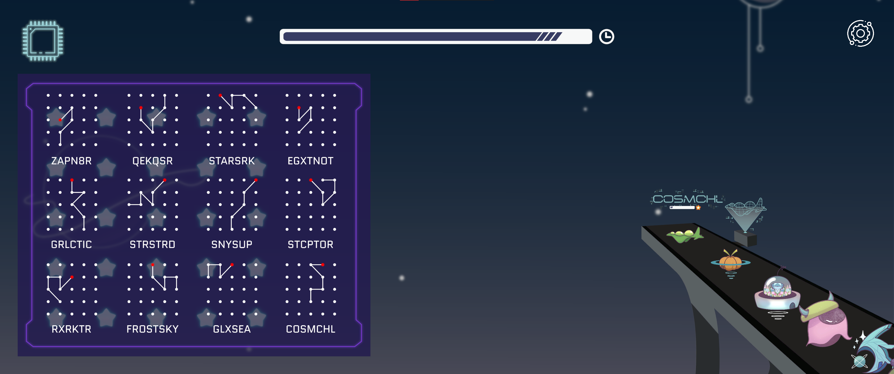

# oHMysTArs?!#

Created as part of the final project for Swinburne GAM20002 - Pervasive Game Design Lab.


oHMYsTArs is a single-player 2D game designed for those who crave the challenge of memorization. The game is targeted for players between the age of 12+ both female and male audiences. Engrossing players in memorizing certain patterns while paying attention to detail, this game is perfect for players who are here to test their memory and multi-tasking skills.
Drawing inspiration from the familiar act of unlocking a phone screen, our game offers a unique and immersive experience.

With a combination of airport management simulation and pattern memorization gameplay, "oH mY StARs" sets itself apart from the rest.

## Features

### Interactive tutorial


A tutorial is integrated into the first level, help guiding players to learn the mechanics interactively as they play along.

### Gameplay


A level will consist of a sequence of spaceships waiting to be served. Players are to take note of their cosmic carplate as displayed by the flickering hologram scanner, then lookup the pattern they need to draw in the cheatsheet.


Once memorized, players are to redraw the pattern as quickly as possible in the cosmic GPS. Each spaceship has its own timer, and if the player fails to draw correctly before it runs out, the spaceship will be sent to a black hole and counts as a "failed" customer. The game ends when all customers have been served, or when the overall level timer has run out.

### End-of-level assessment


At the end of a level, the players will be evaluated based on several criteria: [profitability](Assets/Script/System/Assessment/Profitability.cs), [timeliness](Assets/Script/System/Assessment/Punctuality.cs) and [accuracy](Assets/Script/System/Assessment/Accuracy.cs). This data is saved to `Application.PersistentDataPath`, under `level_result.json`. For the time being, the assessment schema is assumed static and hardcoded. There are future plans to automate this as well.


When levels are replayed multiple times, the best attempt will be recorded, overriding all older attempts.

### Collectible

#### Spaceship


At the end of a level, all spaceships encountered will be added to the spaceship collection. This data is saved to `Application.PersistentDataPath`, under `spaceship_collectible.json`.

#### Feedback

There are future plans to make all client feedbacks collectible.

## Prerequisites

The project is built with Unity 2022.2.4f1. To run the project, an equal or higher version of Unity is recommended.

## Data pipeline

An existing pipeline for automated asset serialization from static CSV data is established. From the editor, run `Utility/Parse/All`.

All scriptable objects generated can be found under [Assets/Resources](Assets/Resources/), categorized into subdirectories accordingly.

### Pattern

Can be parsed separately in the editor by running `Utility/Parse/Pattern`.

Patterns are read from [Pattern_data.csv](Assets/Editor/CSV/Pattern_data.csv). The file follows the format:

```
PatternName, node1, node2... node25
```

With each node representing a single point in the grid:

```
col;row
```

Index count starts at 0.

Generated patterns will be saved under [Assets/Resources/Pattern](Assets/Resources/Pattern/).

### Feedback

Can be parsed separately in the editor by running `Utility/Parse/Feedback`.

There are 4 distinct types of feedbacks, corresponding to the 3 assessment criteria and overall average.
Feedbacks are read from:

- [Feedback_data_profitability.csv](Assets/Editor/CSV/Feedback_data_profitability.csv)
- [Feedback_data_punctuality.csv](Assets/Editor/CSV/Feedback_data_punctuality.csv)
- [Feedback_data_accuracy.csv](Assets/Editor/CSV/Feedback_data_accuracy.csv)
- [Feedback_data_efficiency.csv](Assets/Editor/CSV/Feedback_data_efficiency.csv)

Regardless of subtype, a feedback data file follows the format:

```
"FeedbackContent", StarRating
```

With `StarRating` an integer ranging from 1 to 5.

Each generated feedback will be randomly assigned a PNG avatar profile under [Assets/Resources/Feedback/Avatar](Assets/Resources/Feedback/Avatar/).

Generated feedbacks will be saved under [Assets/Resources/Feedback](Assets/Resources/Feedback/), categorized in subdirectories accordingly.

### Spaceship

Can be parsed separately in the editor by running `Utility/Parse/Spaceship`.
Requires existing `Pattern` with matching name to be found under [Assets/Resources/Pattern](Assets/Resources/Pattern/).

Spaceships are read from [Spaceship_data.csv](Assets/Editor/CSV/Spaceship_data.csv). The file follows the format:

```
SpaceshipName, PatternName, VIP
```

With VIP as an integer to indicate the ship's privilege, `1` being `true`.

Each generated spaceship will be assigned:

- A normal solid texture with matching name, found under [Assets/Resources/Spaceship/Texture/Solid](Assets/Resources/Spaceship/Texture/Solid/).
- A holographic texture with matching name suffixed with `_scan`, found under [Assets/Resources/Spaceship/Texture/Scan](Assets/Resources/Spaceship/Texture/Scan/).
- A silhouette texture with matching name suffixed with `_unlock`, found under [Assets/Resources/Spaceship/Texture/Unlock](Assets/Resources/Spaceship/Texture/Unlock/).

Generated spaceships will be saved under [Assets/Resources/Spaceship/Model](Assets/Resources/Spaceship/Model/).

### Level

Can be parsed separately in the editor by running `Utility/Parse/Level`.
Requires existing `Spaceship` with matching name to be found under [Assets/Resources/Spaceship/Model](Assets/Resources/Spaceship/Model).

Levels are read from [Level_data.csv](Assets/Editor/CSV/Level_data.csv). The file follows the format:

```
LevelNumber, Spaceship1, Spaceship2...
```

With `LevelNumber = 1` automatically triggering the interactive tutorial on play, thus must start with a normal spaceship followed immediately after by a VIP spaceship, followed by at least 1 more spaceship.

Generated levels will be saved under [Assets/Resources/Level](Assets/Resources/Level/).

## Built With

- [Unity 2022.2.4f1](https://unity.com/releases/editor/whats-new/2022.2.4#release-notes) - The version of Unity used

## Authors

- **Thien An Ly** - _Lead programmer, level designer, UI developer, database designer_ - [thelazyant164](https://github.com/thelazyant164)
- **Audrey Juventia** - _Asset artist, UI designer, mechanics designer, original idea_ - [Jay](http://oddex.nightcode.id/)
- **Lachlan Haines** - _Asset artist, sound designer, content designer_
- **Meng Yu Lim** - _Lead artist_ - [Powort](https://powort.carrd.co/)
- **Wendy Nguyen** - _Lead tester, content writer, UI/UX designer, presenter_

## License

This project is licensed under the MIT License - see the [LICENSE.md](LICENSE.md) file for details
